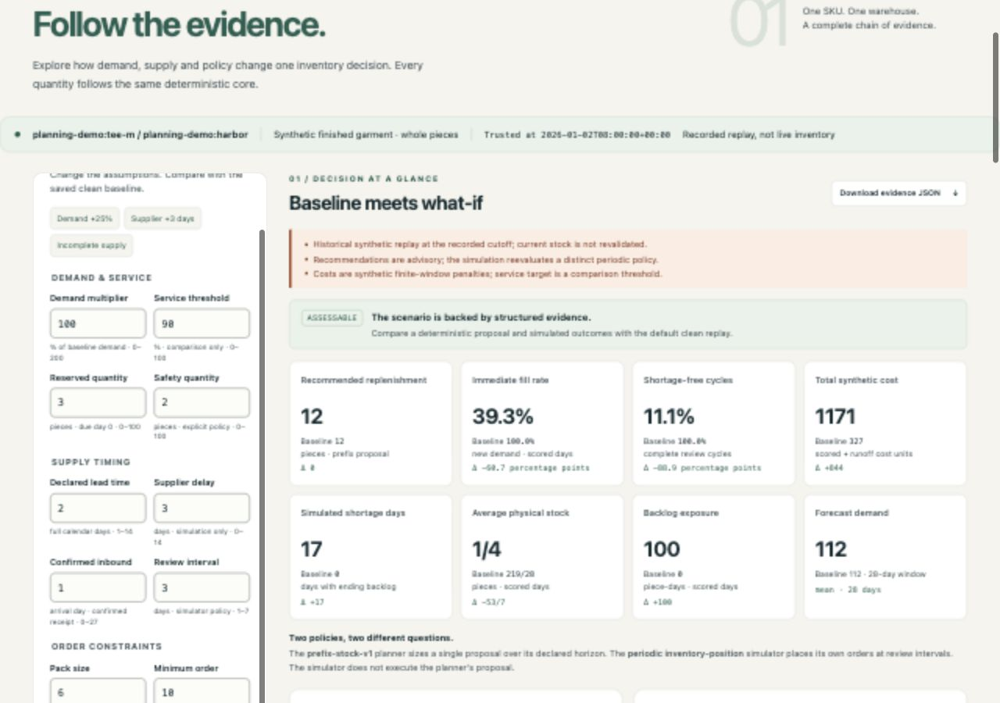
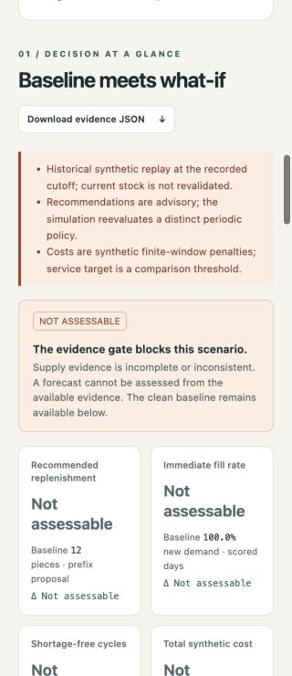

# Decision Lab accessibility and UX review

2026-10-03, local synthetic replay on `codex/lab-accessibility`, starting from
main `f6d3d1`. This is a targeted browser/code review, not a full WCAG certificate
or a screen-reader speech test. No backend arithmetic, source archive, API schema
or research result changes were required.

## Findings and fixes

| Observed issue | Change | Verification |
|---|---|---|
| Disabling the submit control dropped focus to body | Retain the original form focus and restore it after enabling, only if focus is still on body | Keyboard Run and retry finish on `run-button`; errors focus the alert |
| Numeric accessible names included the unit hint twice | Name each input with its short visible label; retain the separate description | All ten numeric controls have valid distinct name/description references |
| Wide evidence tables had no keyboard scroll target | Add named, focusable regions around existing tables | Arrow keys scroll the prefix table to 80px; visible outline and table semantics remain |
| Blocked reason codes made a 320px page 339px wide | Human-readable reasons, shrinkable text and a stacked narrow assessment | Blocked page width is exactly 320px; baseline and null scenario outputs remain visible |
| Some muted text and baseline graph colors were too faint | Darker helper/status text, input boundaries and baseline strokes | Rendered ratios recorded below |
| Chart series depended on color distinctions | Distinct dotted, short-dash, long-dash and solid strokes with matching legends | Physical-stock chart has four distinct patterns; exact values remain in tables |
| Disclosure outline could be clipped by its container | Inset the trace-summary focus outline | Existing native disclosures remain keyboard-operable |

Selected rendered contrast checks: helper text on paper **5.44:1**, on green
**5.24:1**, blocked label on orange **5.58:1**, numeric input boundary **3.46:1**.
Baseline stock/backlog strokes on white are **4.82:1 / 4.42:1**, previously
**2.83:1 / 2.20:1**. These measurements cover the changed elements, not every
pixel/state of the application. Decorative hero art is not evidence text.

## Actual browser path

Tested in the Codex in-app browser at explicit 1280×900 and 320×740 CSS viewports:

- Keyboard supplier preset → Run: proposal12, immediate fill39.3%, total cost1171,
  with baseline12 / 100% / 327. Focus returns to Run and completion status updates.
- Demand +25% → Run: proposal18, cost351; baseline remains12 / 327.
- Demand201 fails native range validation, focuses the input and exposes
  `aria-invalid=true`; correcting it clears the invalid marker.
- Incomplete supply → Run: null recommendations/service/cost remain labeled
  `Not assessable`; the clean baseline remains available. Human-readable blocking
  evidence wraps within320px. No value is substituted with zero.
- Native disclosure Enter, table ArrowRight and keyboard skip link work. The
  table is a named region with a visible outline; skip moves focus to `main`.
- Stopping the owned local server makes Run focus `form-errors` with `role=alert`
  and retains the previous successful comparison. Restarting the same service
  and retrying clears the error, updates the status and restores Run focus.

[Browser receipt with source/screenshot hashes](review/lab-accessibility-browser.json).
23 existing Lab/API tests pass on Python3.12.14 / Psycopg3.3.6; `node --check`
passes. No new test suite, database, model API, external service or build was
needed. The test server and temporary browser tab were retired; viewport override
was reset. Development verification used a fresh local origin because ordinary
reload retained cached static assets, and the served bytes were checked against
the checkout before acceptance.

Keyboard export reached its download announcement, but the browser tool's
download event retrieval timed out. File bytes were **not** independently
rechecked this round. The unchanged export implementation and earlier accepted
download validation are preserved; this review does not claim a new export audit.

## Guided demo and remaining work

Existing presets already cover the useful stories. Reset restores clean inputs;
press Run to evaluate them. Demand +25% shows proposal changes, Supplier +3 days
shows hidden supply timing, and Incomplete supply shows the evidence gate. No
additional preset framework or duplicate scenario engine was added.

Remaining manual coverage: actual VoiceOver/NVDA speech, browser zoom behavior,
forced-color rendering, other browser engines and a comprehensive conformance
audit. Reduced-motion handling, semantic tables, native form validation, status
and alert live regions were already present. Keep this limited acceptance
separate from hosting, availability, security and production service claims.

