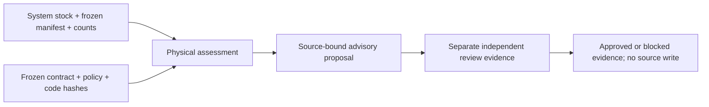

# Physical-count corroboration and adjustment evidence

This additive synthetic research layer distinguishes ledger/snapshot consistency
from physical-count evidence at a frozen business cutoff. It produces an advisory
assessment and separately evaluates a source-bound review. It never adjusts the
source stock, writes an ERP transaction, or changes Stage 1 / planning / Lab behavior.

The [contract](CONTRACT_PHYSICAL_COUNT_V1.md) was committed as `605b34a` before
implementation. The implementation, 40 independently declared expected outcomes,
and archive script were committed as `340cb1f` before the first assessment archive.
[Inputs and expected outcomes](examples/physical-count-inputs-v1.json),
[saved assessments and lineage](review/physical-count-v1.json),
[acceptance receipt](review/physical-count-acceptance.json).

## What the controls establish

For the clean shortage control, system stock is **100 pieces**. Two source-declared
blind observations from distinct observer IDs both count **96 pieces** during the
same complete frozen session. The corroborated variance is **−4 pieces**. The
proposal binds the original stock, manifest and every count, including identities
and business/knowledge clocks. System stock remains **100**.

One observer, including two observations from the same observer ID, produces
`recount_required` with null physical quantity and variance. Conflicting counts
also require recount; a two-to-one majority cannot override that conflict.
Incomplete scope, duplicate natural identities, future evidence, unfrozen stock
and invalid whole-piece quantities block assessment. Missing observations never
become a zero count. A complete corroborated zero-count control is separately valid.

A review can approve the signed −4 proposal only if its source binding still
matches, its reviewer differs from the count observers, and its knowledge clock
is valid. Changing the counted quantity or source clock invalidates an old review.
The review is still advisory evidence: even the approved control performs **zero
inventory writes**. The layer accepts a declared reason such as
`unexplained_variance`; it does not infer theft, shrinkage or operational cause.

| Physical assessment | Controls / 40 |
|---|---:|
| Confirmed match | 3 |
| Confirmed variance | 11 |
| Not assessable | 21 |
| Recount required | 5 |

| Adjustment review | Controls / 40 |
|---|---:|
| Approved evidence | 1 |
| Rejected | 1 |
| Review required | 2 |
| Invalid / not assessable review | 8 |
| No proposal | 28 |

These deliberately chosen controls are **correctness coverage**, not estimates of
warehouse quality, shrinkage rate, approval frequency or count accuracy.
`corroborated` is a categorical policy outcome, not a calibrated probability.

## Provenance and verification



The saved archive contains **86 dependency nodes**: five source-file nodes, one
policy node, 40 exact-input nodes and 40 assessment nodes. File bytes are pinned
against the recorded implementation commit. Assessment fingerprints bind their
inputs, policy and implementation dependencies. A later evaluation clock changes
the run identity; reordering unchanged count rows preserves proposal identity.
These are local count-package dependencies, not a completed global
reliability → forecast → plan → simulation → UI attestation system.

Focused acceptance passes **7 tests**, covering all **40** hand-declared outcomes,
quantity/identity/clock controls, deterministic replay and no input mutation.
The saved-artifact audit validates all 40 cases and 86 nodes with **zero
reassessments**. Disabling the evaluator still allows cache reuse and leaves
archive bytes unchanged. Ten purposeful artifact mutations were rejected:
physical quantity, corroboration category, evaluation clock, source binding,
proposal delta, approved delta, dropped count, dropped review, dangling edge and
cyclic edge. The eight result mutations recomputed their result and lineage
fingerprints before audit; semantic/binding checks still rejected them. This is
bounded fault injection, not whole-project mutation-test coverage.

From the repository root in the existing Python 3.12 environment:

```sh
PYTHONPATH=src python -m unittest tests.test_physical_count
PYTHONPATH=src python -m scripts.physical_count_benchmark --audit
```

The normal archive command reuses and verifies an existing output. It refuses
source/config drift; first generation requires committed source files and oracles.
No database, new dependency, model API, real business data or full pipeline is
needed. Archived output SHA-256 is
`6bb206d502e667de641ede9d708b9950c3cde95b1c72005a63f2f942af0a70b5`.

## Limits and next steps

Upstream `pass`, complete coverage, freeze, blind-count status and observer IDs are
**synthetic source declarations**. This layer does not rerun Stage 1, authenticate
signers, establish real human independence, prove that warehouse movement stopped,
or validate a physical warehouse. Its cutoff does not establish later availability.
An operational adjustment workflow would require a separate approved contract,
authenticated roles and transactional evidence. No current proposal is executable.

The broader 22-direction roadmap is recorded in
[the open research documentation package](https://github.com/daniel-li2021/inventory-intelligence/pull/19).
The next independent accessibility deliverable is a concrete hosted-demo proposal
with an operating/cost boundary and acceptance plan. Global artifact attestation
and a planner execution adapter remain separate gated extensions; the count DAG
alone does not complete either. Existing public-sales, calibration, policy and
lost-sales packages retain their original evidence and pending integration status.
