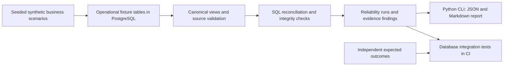

# Stage 1: Inventory Reliability — proposed plan

Status: milestone 1 is implemented and accepted against [CONTRACT_V1.md](CONTRACT_V1.md); see the [completion review](STAGE1_REVIEW.md). That contract takes precedence over this original design discussion. The temporal expansion below is future hardening beyond v1, not a claim of implemented functionality. Reference evidence and version caveats are in [RESEARCH.md](RESEARCH.md).

## Recommendation

Build a small **read-only inventory reliability layer over existing operational database records**. Python runs explicit SQL checks in PostgreSQL and produces findings with evidence. Docker Compose supplies a reproducible synthetic database. Do not install an ERP or introduce a transformation/observability platform for the first milestone.

The initial architecture makes sense, with three refinements:

1. Treat the movement ledger as an observed source representation, not automatically as truth. Reconciliation compares two pieces of evidence; agreement does not prove physical stock is correct.
2. Keep source snapshots independent of ledger recomputation. A snapshot generated from the same SQL under test would make the demonstration circular.
3. Make time, source completeness, and identity part of the first design. Otherwise normal timing differences look like corruption, and missing data looks like a clean zero.

The useful portfolio story is: **a reproducible discrepancy, a deterministic finding, a source-record explanation, and a test proving it**.

## High-level architecture



Use one PostgreSQL instance and two schemas initially:

- `operational_fixture`: synthetic styles, SKUs, warehouses, opening balances, movements, snapshots, and batch manifests. Only the generator/test setup writes here.
- `reliability`: canonical views, recomputed balances, run records, check outcomes, and findings. The checker has SELECT on operational inputs and writes its own results only.

Operational fixtures are already structured database records. There is no upload/form workflow. Preserve imperfect source rows so defects can be detected; enforce primary keys on fixture row IDs, but avoid foreign-key/uniqueness constraints on raw business references that would reject the very faults being demonstrated. Validate them before producing reliable balances. Future curated tables can enforce those constraints.

Start with full reconciliation of the tiny dataset. No scheduler, incremental engine, ORM, API service, queue, or general-purpose rules framework is necessary. If real ingestion becomes necessary later, add a bounded adapter; if model dependencies/backfills become substantial, evaluate SQLMesh. These are separate decisions.

## Minimal domain and evidence model

- **Style:** stable `style_id`, fictional code/name. A style groups variants; it is not a stockkeeping unit.
- **SKU:** stable `sku_id`, `style_id`, color, size, unique business SKU code, base unit `each`. The fixture defines uniqueness of style/color/size. Do not parse IDs from names or aggregate stock only by style.
- **Warehouse:** stable `warehouse_id` and fictional code. First-version balance grain is `(sku_id, warehouse_id)`. One business entity, finished garments, and whole pieces only. Fabric, lots, ownership, quality buckets, and bin locations are deferred, not implicitly merged if later supplied.
- **Opening balance:** quantity, effective cutoff, and baseline reference at that grain. Mark it as an assumed baseline. No complete movement history means a reliable opening anchor is required.
- **Movement leg:** unique fixture row ID; source system, source event/document ID, document line, and leg ID; SKU, warehouse, signed quantity, movement type, posting status, business `effective_at`, source recording/sequence information, and local `observed_at`. Include `transfer_id`, reversal reference, and adjustment reason when relevant. A source business key identifies a leg, not just a document: valid multi-line documents and the two legs of a transfer are distinct.
- **Snapshot observation:** snapshot/batch ID, SKU, warehouse, independently reported `on_hand_qty`, business `as_of`, observation time, and the movement watermark it includes. Keep historical observations rather than replacing yesterday's evidence with today's value.
- **Source batch manifest:** completion status, expected coverage, record counts, business cutoff, and included movement watermark. An absence of movements is meaningful only when extraction coverage is known complete.
- **Run/check/finding:** run ID, input batch IDs, cutoffs/watermarks, code/check version, execution time, evaluated/skipped/error state, severity, affected keys, source row IDs, expected/observed quantities, delta where assessable, and evidence/reason. Keep an explicit pass outcome for evaluated checks even when there are no finding rows.

Use integer quantities for garment pieces, `timestamptz` for instants, and exact comparison with zero tolerance. If fractional units are introduced, use a declared `numeric` scale and conversion policy rather than floating-point tolerances. PostgreSQL distinguishes [exact integers/decimals from inexact floating-point types](https://www.postgresql.org/docs/current/datatype-numeric.html).

Keep on-hand, reserved, and available quantities distinct. Only on-hand is required in milestone 1; a reservation is not a physical movement. Borrow that distinction from [Odoo's quantity model](https://github.com/odoo/odoo/blob/19.0/addons/stock/models/stock_quant.py).

## Reconciliation contract

For baseline state at `t0`, snapshot business cutoff `T`, and its included source watermark `W`:

```text
expected_on_hand(T, W)
  = opening_balance(t0)
  + SUM(posted signed movement quantities with t0 < effective_at <= T
        and source sequence <= W)

delta = snapshot_on_hand(T, W) - expected_on_hand(T, W)
```

Use only posted physical movement legs. Include posted reversal legs with their signed effects; do not count the original and also subtract it a second time merely because it is marked cancelled. Pending orders and reservations do not change on-hand. Adjustments require provenance rather than silent overwriting.

Compare quantities at the same grain, business cutoff, and source watermark. For the same live PostgreSQL database, read inputs in one consistent transaction; [Repeatable Read](https://www.postgresql.org/docs/current/transaction-iso.html) avoids statement-to-statement read skew. It does **not** make an old snapshot current or establish consistency across independently extracted databases. A real adapter must prove what the snapshot includes; an unavailable watermark/completeness guarantee produces `not_assessable`, not a confident discrepancy or pass.

Use an explicit coverage set and full outer comparison. Detect keys missing on either side and duplicate snapshot rows; never coalesce a missing snapshot/opening balance into zero. Only a complete batch with an explicit zero or documented sparse-zero contract establishes zero stock.

Keep business time separate from recording/ingestion time. A backdated movement observed later must not retroactively change what a prior report knew. New evidence creates a new run; old findings retain their input references. Fresh ingestion of an old source snapshot does not satisfy freshness.

Transfers in milestone 1 are immediate paired legs: same SKU, different warehouses, equal-and-opposite quantities, same completion/cutoff, and a shared transfer ID. Check cardinality and identity, not just a net zero sum. Real multi-day transfers later use explicit transit locations/state; an in-transit item is not automatically a broken transfer.

For ambiguous/invalid source rows, emit source findings and mark affected balances unassessable. Do not silently drop rows and then claim the remainder is trustworthy. A discrepancy can establish inconsistency; identifying the bad document conclusively may require independent receipts, counts, or other evidence. Report candidate causes as candidates.

## Smallest meaningful first milestone

**One end-to-end PostgreSQL reconciliation demo**, with approximately three styles, twelve size/color SKUs, two warehouses, and a few days of receipts, shipments, returns, adjustments, and immediate transfers.

Implement five check families:

1. Ledger-versus-snapshot quantity mismatch at an aligned cutoff.
2. Duplicate source movement-leg keys, including conflicting duplicates.
3. Unknown SKU/warehouse references or missing opening coverage.
4. Incomplete or incorrectly paired completed transfers.
5. Stale, incomplete, missing, or duplicate snapshot/batch coverage.

The fixture scenarios have explicit expected outcomes. Single-fault cases establish each rule's behavior; one combined case exercises interactions and suppression of unjustified downstream deltas. Include legitimate multi-line documents, zero stock, two transfer legs, a posted reversal, and a late observation whose watermark belongs to a later run as clean controls.

Completion means:

- A documented command creates the synthetic database and runs the demo from a fresh checkout; a second command executes the tests.
- Tests assert exact findings by rule, source record/balance key, severity, and quantity delta where applicable. Clean controls have zero unexpected findings. Fault labels exist only in test expectations and are not available to the checker.
- At least one small manually calculated golden scenario independently verifies arithmetic and cutoff boundaries. A generator cannot serve as the only oracle for the checker.
- Repeating the same inputs/cutoff produces the same semantic findings; run IDs/timestamps may differ. Changed input is a new report with preserved history.
- The JSON/Markdown report states coverage and freshness, gives source evidence, and separates `pass`, `fail`, and `not_assessable`. Execution errors are distinct from detected business failures. Suggested CLI exit statuses: 0 pass, 1 findings/unassessable, 2 execution error.
- Tests execute the actual SQL on PostgreSQL in GitHub Actions. A test detecting injected bad data passes only when the findings match the oracle.

Do not add a synthetic "trust score". A score would hide which rules ran and which inventory buckets are affected. Agreement under tested rules is internal consistency, not certification of physical stock or source completeness.

## Proposed implementation structure

Existing research/workflow files remain. Create the following only after implementation is requested:

```text
compose.yaml                         # PostgreSQL; containerize the runner only if useful
pyproject.toml                       # Python package and reviewed dependency versions
src/inventory_intelligence/
    __main__.py                      # argparse CLI
    reliability.py                   # run SQL, persist evidence, render report
sql/
    schema.sql                       # synthetic source + reliability schemas
    views.sql                        # documented normalization and balance derivation
    checks.sql                       # fixed SQL checks returning violating records
synthetic/
    generate.py                      # deterministic scenarios, no company-derived schema
tests/
    test_reliability.py               # PostgreSQL tests + independent expected findings
    fixtures/                        # small input cases and expected results
docs/examples/                       # curated report once verified
.github/workflows/ci.yml              # extend existing CI with real database tests
```

Start with Psycopg 3 as the only application dependency, stdlib `argparse`/`json`/`unittest`, and SQL doing joins/aggregation. Version-pin dependencies and the database image when implementation starts. Do not create empty packages for forecasting/copilot, introduce an ORM/migration framework for one bootstrap schema, or add pandas just to sum inventory.

## Stage 1 roadmap

1. **Direction and contracts — current review.** Agree on inventory grain, signed movement semantics, cutoff/watermark contract, clean controls, and the five fault families. Repository and initial CI setup accompany this research.
2. **Reconciliation milestone — roughly 3–5 focused development days.** Schema, deterministic synthetic inputs, SQL checks, evidence report, golden case, and real PostgreSQL CI arrive together. End with a clean-versus-corrupt demo.
3. **Temporal and audit hardening — roughly 2–4 days.** Expand cancellation/reversal validation, backdated corrections, negative running balances under an explicit policy, batch interruptions, run history, and changed/duplicate source records. Add reservations only with an independent source contract; keep transit handling explicit if introduced.
4. **Portfolio finish — roughly 1–2 days.** Reproducible quickstart, annotated example report, limitations, architecture walkthrough, and focused test evidence. Add a small report viewer only if CLI output impedes explanation.

Effort estimates are planning ranges, not deadlines. Stage 1 is complete when the checks and limitations are demonstrable and reproducible, not when a dashboard looks polished.

For Stage 2, preserve SKU identity, event time, and reliability status now; later add separate sales/orders, stock availability, inbound supply, lead times, and production constraints. Shipments alone are not uncensored demand. Evaluate StatsForecast for simple baselines and intermittent demand before complex ML. Stage 3 can consume the structured evidence and versioned results; no LLM, vector database, or agent infrastructure belongs in this first milestone.
